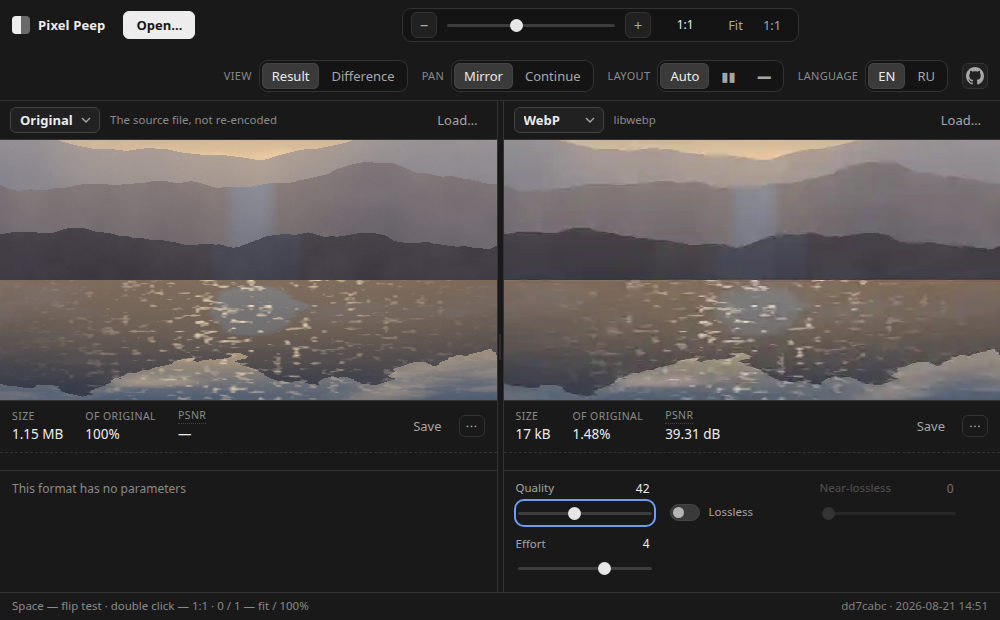

# Pixel Peep

**https://pixel-peep.pages.dev**

A tool that answers one question: **how hard am I willing to compress my photos.**

Not "which codec wins" in general — that depends on the picture — but how far *this* photo can go
before *you* can see it. So the answer is given by eye. Two panels show the same frame encoded
differently, the zoom is synchronised and exact, and holding the space bar flips between them.

Nothing is uploaded. The files never leave the browser: every encode runs locally in a wasm worker,
which also means it works offline and on photos you would not send to a stranger's server.



<sub>Photograph: *[Mountain Landscapes of Scotland](https://commons.wikimedia.org/wiki/File:Mountain_Landscapes_of_Scotland.jpg)*
by Liliacevez, [CC BY-SA 4.0](https://creativecommons.org/licenses/by-sa/4.0/), cropped and re-encoded.</sub>

---

## What it is good for

**Choosing a quality setting you can live with.** Put the original in one panel and a candidate in
the other, zoom to 1:1, and hold space. Flicker in one place on screen is something the eye catches
incomparably better than a difference between two pictures side by side — this is the whole reason
the tool exists, and it is worth trying before anything else here.

**Comparing formats honestly.** WebP q80 against AVIF q50 at the same file size, on your photo
rather than on a test corpus. Each panel shows what it costs: bytes, percentage of the original,
PSNR, and SSIM and bits-per-pixel if you open the row.

**Finding where a codec breaks.** Switch the view to **Difference** and the panel shows
`|result − original|` with a gain slider — ringing around hard edges, blocking in smooth gradients,
and chroma smeared by 4:2:0 all become obvious long before they are visible in the picture itself.

**Comparing two shots.** Drop a different photo onto each panel and encode both the same way, to see
which frame survives compression better.

**Checking what your phone did.** HEIC files from an iPhone open directly, with their orientation
handled correctly.

## Formats

Encoding: **JPEG** (mozjpeg), **WebP** (libwebp), **AVIF** (libavif), **JPEG XL** (libjxl),
**PNG** (oxipng) — with the original alongside them for reference.

Opening: JPEG, PNG, WebP, GIF, BMP, AVIF, **HEIC/HEIF** and **JPEG XL**.

Any panel can save its encoded result, so once you have found a setting you like you can keep the
file.

## Using it

| | |
|---|---|
| **space** (hold) | flip test — every panel shows the first one's content |
| wheel / pinch | zoom, anchored under the cursor, synchronised across panels |
| drag | pan |
| double click | fit ↔ 1:1 |
| `0` / `1` | fit / actual pixels |
| `+` `−`, arrows | zoom and pan in steps |

**Open…** loads one photo into every panel. To compare two different photos, drop one onto a panel
or use that panel's own **Load…**.

**Mirror / Continue** decides whether the panels show the same fragment twice or continue one
another, which is useful for following a single edge across both.

When the panels hold frames of different sizes, an **Alignment** control appears — fit, by width, or
by height. At 1:1 it steps aside: both panels are then strictly one image pixel per display pixel,
which is the point of that position.

The interface is available in English and Russian.

## A word about the numbers

PSNR and SSIM are shown because they are cheap and occasionally informative, not because they
decide. PSNR correlates poorly with perception: a frame nudged slightly in brightness scores badly
while a smeared one scores well. Treat them as a hint and trust the flip test.

The quality sliders are not one scale either. Each number belongs to its own codec: JPEG XL's 75 is
a Butteraugli distance of 2.35 — more than twice the point libjxl itself calls visually lossless —
while JPEG's 75 is an ordinary setting for the web. Every format here opens at its own maker's
default rather than at a shared number, and the tooltip on a slider says what that number means.

PNG is in the format list as a control rather than a competitor — being lossless, its PSNR must read
`∞`. If it ever does not, the tool is broken, not the codec.

---

## Running it locally

```bash
npm ci
npm run dev
```

Node 20.19+ or 22+. That is all — there is no backend, no configuration and no API key.

## Contributing

- [Architecture](docs/architecture.md) — how it is put together, the geometry, memory constraints
- [Adding a codec](docs/codecs.md) — one file and one line in the registry
- [Translations](docs/i18n.md) — copy one file, translate the strings; partial ones are welcome
- [Testing](docs/testing.md) — what runs, and what the tests do not catch
- [Self-hosting](docs/self-hosting.md) — put your own copy anywhere; two headers and a folder
- [How this deploys](docs/deploy.md) — the Cloudflare and CI setup behind pixel-peep.pages.dev

## License

The code is MIT.

One exception, because it is somebody else's work: `docs/screenshot.png` contains the photograph
credited above, which is CC BY-SA 4.0. ShareAlike applies to adaptations, so that file is CC BY-SA
4.0 rather than MIT. Nothing else in the repository is affected — in particular the code is not,
since the screenshot is not derived from it.
